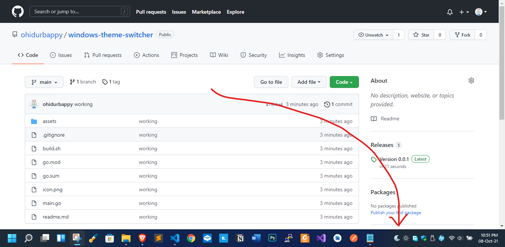

# Windows theme switcher  [](icon.png) 

This program will appear on the system tray and help
switch the taskbar theme on windows.

To use it download the `exe` file from the `release` section
and place the `assets` folder in the same directory as the 
`exe`. Now add it to startup from task manager.


Install the necessary dependencies

```
go install github.com/tc-hib/go-winres@latest
```


To build run:

```
./build.sh
```

#### Preview



Todo:

- Create  a setup file that add adds the program to startup