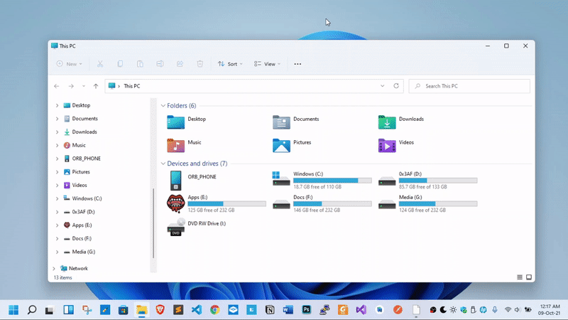

# Windows theme switcher  [](icon.png) 

This program will appear on the system tray and help
switch the taskbar theme on windows.


#### Preview




### How to use:

#### Option 1: Use the binary

Download the 'Windows.Theme.Switcher.exe' from the release section.
Put it in "c:\" or any other drive. Now run it. That's it.
It will automatically start with windows.


`OS: Windows 10, 11`

[Download](https://github.com/ohidurbappy/windows-theme-switcher/releases/latest/download/Windows.Theme.Switcher.exe)

<!-- To use it download the `exe` file from the `release` section
and place the `assets` folder in the same directory as the 
`exe`. 

Now Open Run (CTRL+R) and put `shell:startup` and Enter

Create a shortcut to the `exe` in here. -->

#### Option 2: Build it yourself

Install the necessary dependencies

```
go install github.com/tc-hib/go-winres@latest
```


To build run:

```
./build.sh
```

That's it.