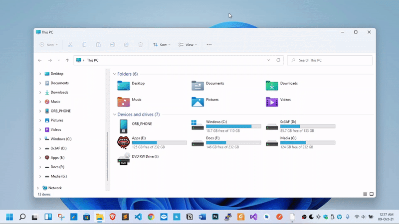

# Windows theme switcher  [](icon.png) 

This program will appear on the system tray and help
switch the taskbar theme on windows.


#### Preview




### How to use:

#### Option 1: Use the binary

Download the 'Windows.Theme.Switcher.exe' from the release section.
Put it in "c:\" or any other drive. Now run it. That's it.
It will automatically start with windows.


`OS: Windows 10, 11`

[Download](https://github.com/ohidurbappy/windows-theme-switcher/releases/latest/download/Windows.Theme.Switcher.exe)

<!-- To use it download the `exe` file from the `release` section
and place the `assets` folder in the same directory as the 
`exe`. 

Now Open Run (CTRL+R) and put `shell:startup` and Enter

Create a shortcut to the `exe` in here. -->

#### Option 2: Build it yourself

Install the necessary dependencies

```
go install github.com/tc-hib/go-winres@latest
```


To build run:

```
./build.sh
```

That's it.

---

### Scheduled Light / Dark Mode

You can configure the app to **automatically switch** between light and dark mode at specific times of day.

#### Via the system tray context menu (right-click the tray icon)

| Menu item | Action |
|---|---|
| **Set Light Time…** | Opens a dialog to enter the time when light mode should activate (HH:MM, 24-hour) |
| **Set Dark Time…**  | Opens a dialog to enter the time when dark mode should activate (HH:MM, 24-hour) |
| **Clear Schedule**  | Removes the active schedule (theme remains unchanged) |

The schedule is **saved to the registry** and restored automatically on the next startup.

#### Via command-line flags

```
Windows.Theme.Switcher.exe -light-time 06:00 -dark-time 20:00
```

| Flag | Description |
|---|---|
| `-light-time HH:MM` | Time of day to switch to light mode (24-hour, e.g. `06:00`) |
| `-dark-time HH:MM`  | Time of day to switch to dark mode  (24-hour, e.g. `20:00`) |

Both flags must be supplied together. The schedule is applied immediately on startup and checked every minute while the app is running.

**Example – light during the day, dark at night:**
```
Windows.Theme.Switcher.exe -light-time 06:00 -dark-time 20:00
```

**Example – wrap past midnight (dark only 01:00–06:00):**
```
Windows.Theme.Switcher.exe -light-time 06:00 -dark-time 01:00
```
